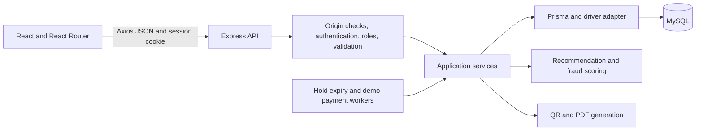
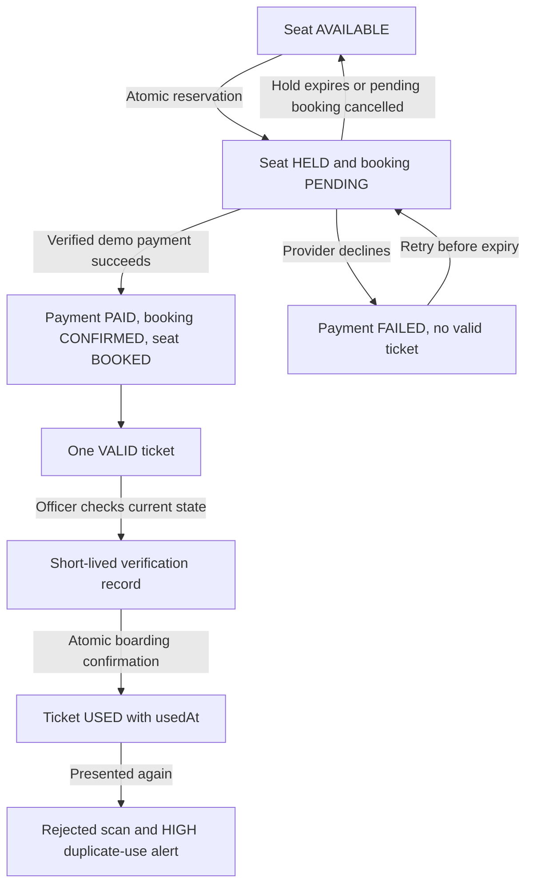

# Architecture

RailConnect is a three-layer web application: a browser interface, an HTTP API and a relational database. React presents information and collects choices; Express owns authorization and business decisions; MySQL stores durable state. Frontend validation improves usability but is never the authority for prices, availability, roles or payment success.

## Request lifecycle

1. React Router selects the page. Axios sends the permitted API URL, credentials and mutation header.
2. Express applies headers, CORS, request limits and JSON parsing. Protected routes verify the signed cookie, live database session, current account status and required role.
3. Zod validates inputs. Services verify ownership, resource state and domain rules using current database records.
4. Prisma performs queries and transactions. Database constraints reject invalid relations and competing unique claims.
5. The API returns explicitly selected public fields. Central error handling returns safe messages; unexpected errors never expose raw SQL or credentials.

Code is organized by domain rather than one large controller. `services/` owns core management and reservations; `recommendation/`, `payments/`, `tickets/`, `officer/`, `fraud/` and `monitoring/` separate their rules. `app.js` constructs the testable Express application; `server.js` owns the listener and workers. Tests can run isolated listeners without starting a second normal development server.

## Main state transitions

A failed payment does not extend a seat hold. Cancellation/expiry and settlement recheck state inside transactions. Boarding does not edit unrelated booking information. Printed tickets are snapshots; online validation is authoritative.

## Transaction boundaries

- Reservation: check journey and inventory, conditionally hold the seat, create the unique active claim and booking, and record relevant evidence together.
- Settlement: verify persisted provider reference/outcome/amount/currency, then update payment, booking, seat and ticket together. An error rolls everything back.
- Boarding: recheck the verification and ticket, conditionally consume the ticket, and write scan/audit evidence together.
- Fraud review: enforce the last-read version, update the alert and retain review history through an audit record in one transaction.

Serializable transactions and bounded conflict retries are used where competing state changes require them. Unique constraints remain the final database guard. The project does not rely on a JavaScript process lock to prevent duplicate reservations.

## Workers, time and reporting

The development backend runs a hold cleanup worker approximately every 30 seconds and a demo payment worker approximately every two seconds. Relevant reads also release expired holds. Workers recover persisted pending state; the browser does not choose whether payment succeeds.

Database timestamps represent instants. Search dates and monitoring day boundaries use Africa/Lagos (UTC+01:00). Dashboard cards represent their labelled lifetime/current totals; chart dates filter the series. Paid-only NGN revenue uses payment time, not booking creation time. Tickets Verified counts distinct tickets with successful scan/boarding evidence, not every repeated scan.

## Deployment boundary

The verified setup is local Windows development with MySQL and one backend process. A production deployment still needs HTTPS, verified database transport security, separate migration/runtime credentials, shared throttling state, operational monitoring, backups, recovery drills and capacity/security tests. No real gateway, offline boarding or trained fraud model is implemented. See [final status](final-status.md).
