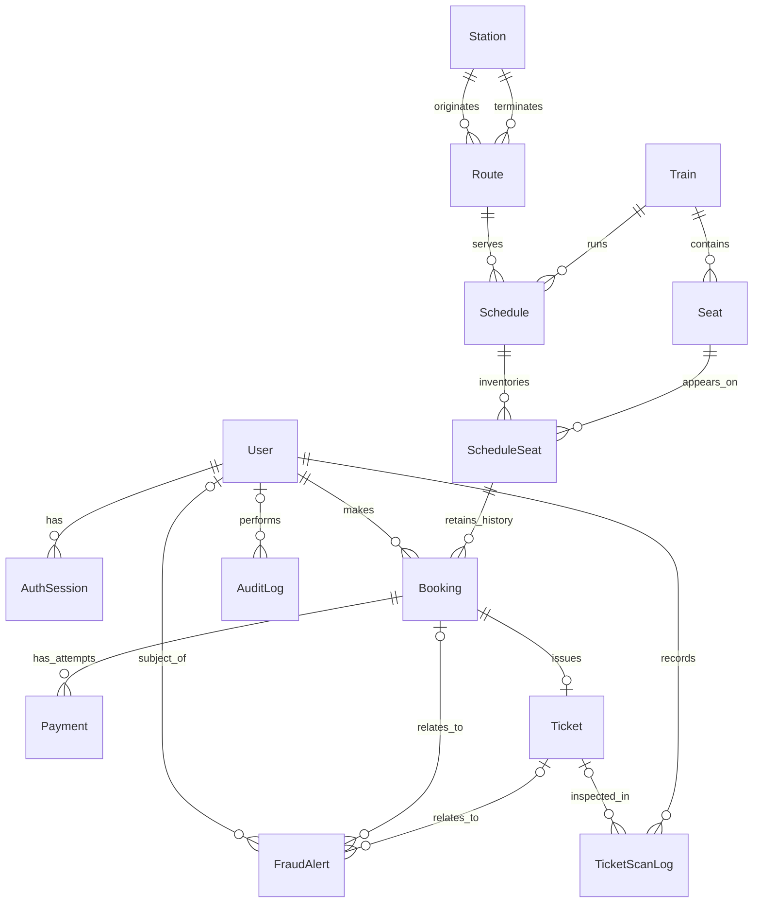

# Database relationships and integrity

The database has 13 railway domain models and one supporting `AuthSession` model. Prisma describes relations and indexes; SQL migrations also install integrity checks and ticket guards. Apply the full migration history, not only a schema synchronization command.

## Entity responsibilities

| Model | Responsibility and relationships |
| --- | --- |
| User | Identity, role and account status; owns bookings and sessions; may be an alert subject, reviewer, officer or audit actor |
| AuthSession | Belongs to one user; records session expiry and supports logout/revocation |
| Station | Physical stop; can originate or terminate many routes |
| Route | One origin and one destination station; used by many schedules |
| Train | Physical train with capacity; has many seats and schedules |
| Seat | Physical numbered seat on one train, with class and operational status |
| Schedule | One train running one route at specific departure/arrival times, with class fares and status |
| ScheduleSeat | Availability of one physical seat on one schedule; retains booking history and at most one active claim |
| Booking | One passenger's reservation for one schedule-seat; stores reference, fare, status and hold expiry |
| Payment | One payment attempt for a booking; retries produce separate attempts, with unique transaction/idempotency references |
| Ticket | At most one per booking; unique number/token, validity and consumption timestamp |
| TicketScanLog | Officer scan/boarding evidence; ticket can be absent when an entry is unrecognized; optionally bound to a schedule |
| FraudAlert | Suspicious-activity evidence, score, severity, explanation/features and latest review; optional user/booking/ticket relations |
| AuditLog | Important operation, optional actor, generic entity reference and sanitized metadata |

The diagram shows principal relationships; the schema additionally links alert reviewers, scan schedules and active seat claims. Audit target identifiers are generic entity references, not foreign keys to every possible target table.

## Why Seat and ScheduleSeat are different

Seat E1 belongs to a train permanently, but its availability changes per journey. `Seat` stores the physical resource. `ScheduleSeat` stores its availability on a particular departure. E1 can therefore be booked on tomorrow's service while remaining available the next day without duplicating the physical seat definition.

`UNIQUE(scheduleId, seatId)` prevents duplicate inventory rows. Composite foreign keys ensure a schedule-seat uses a seat from that schedule's train. A booking's schedule and schedule-seat must also agree.

## How history coexists with uniqueness

Many cancelled or expired bookings can historically refer to the same schedule-seat. Making that historical reference unique would prevent legitimate rebooking. Instead, `Booking.activeScheduleSeatId` is nullable and unique: only one booking can actively claim an inventory record, while inactive historical bookings set it to null. SQL checks keep an active claim aligned with the historical seat and allowed booking state.

The reservation service conditionally changes AVAILABLE inventory inside a transaction. A competing claim cannot also succeed, and unique-key/transaction conflicts become a friendly HTTP 409. The database guard works across different API processes; frontend button disabling is only a usability measure.

## Other important constraints

- Unique normalized email/phone, booking reference, ticket number/token, payment transaction reference and payment idempotency key.
- Unique origin/destination pair and train/seat number; origin must differ from destination.
- Train departure uniqueness and service-level overlap checks; arrival must follow departure, and amounts/capacities obey validation and database integrity rules.
- Decimal currency amounts avoid binary floating-point storage for money. Services compare amount and currency before settlement.
- Ticket creation guards require a confirmed booking and matching successful payment. A ticket cannot be reassigned to another booking.
- Foreign-key restrictions preserve referenced transport and financial history. Unused administrative records may be deleted; related historical records block destructive edits/deletions.
- Indexes support route/date search, status/expiry cleanup, account activity windows and monitoring filters. Ten migrations add the schema and later integrity/auth/booking/payment/officer/fraud/reporting support.

## Timestamps, audit and alert history

Mutable entities carry creation/update timestamps where relevant; events use their occurrence/creation times. Payment settlement and ticket use have explicit times. Alerts keep the latest reviewer fields, while audit entries preserve review decisions and reasons. Application APIs do not offer audit editing/deletion, but a privileged database administrator could modify storage; it is not a cryptographically immutable ledger.

In a defense, describe the database as a normalized operational model with deliberately stored snapshots such as the booked fare. A later schedule price change must not silently change the amount already agreed for a booking.

See the [Prisma schema](../server/prisma/schema.prisma), [migration/setup guide](../server/prisma/README.md), [booking flow](bookings.md) and [payment flow](demo-payments.md).
