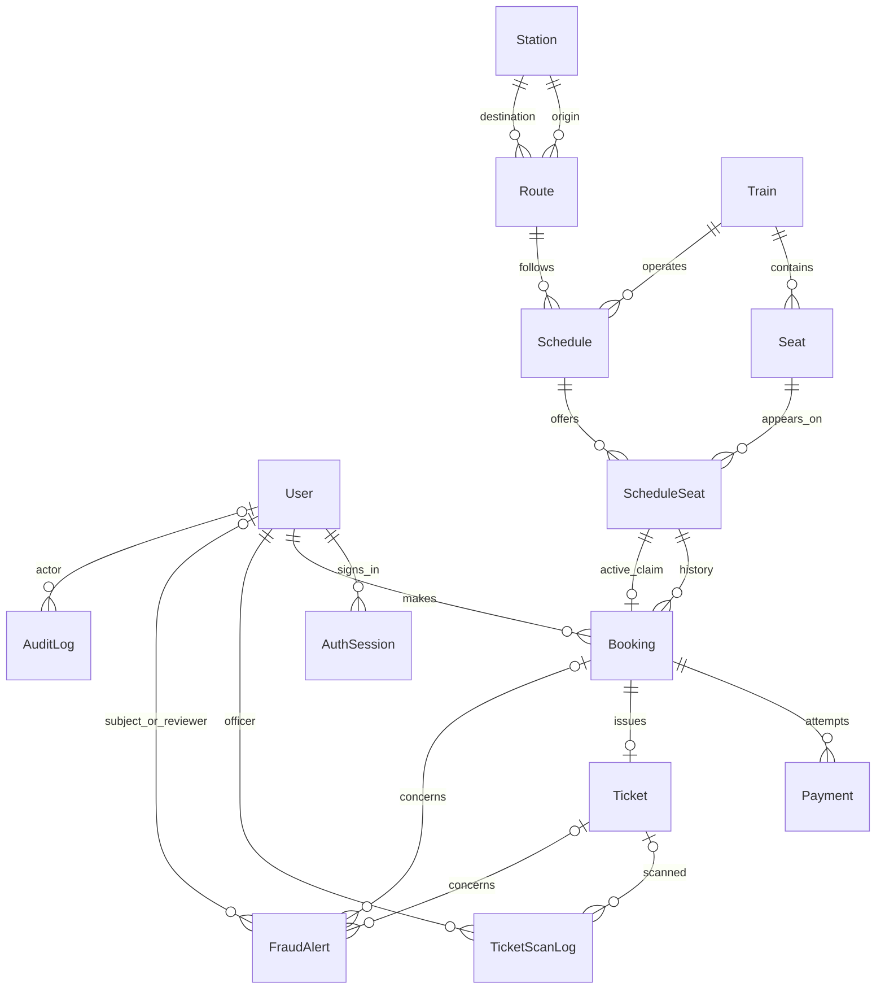

# Phase 2 — relational database

Prisma 7.10 connects the JavaScript backend to **MySQL 8.4** using `@prisma/adapter-mariadb`, which supports MySQL as well as MariaDB. All 13 domain tables are implemented. Phase 3 adds a fourteenth table, `AuthSession`, and authentication APIs; booking APIs remain deferred. See the [authentication guide](../../docs/authentication.md).

## Use the database prepared in this workspace

From the project root in PowerShell:

```powershell
./scripts/mysql.ps1 start
npm.cmd run db:generate
npm.cmd run db:deploy
npm.cmd run db:seed
npm.cmd run db:verify
```

MySQL listens only on `127.0.0.1:3307`. Its data, configuration, binaries and random administrator password are under ignored `.local/mysql/`. The application uses a separate `railconnect` database user. No Windows service, global installation or firewall rule was added. Preserve `.local/mysql/data/` to retain the database.

```powershell
./scripts/mysql.ps1 status
./scripts/mysql.ps1 stop
```

These commands manage only the prepared workspace-local instance. Starting it does not reset data or rerun bootstrap SQL.

## Fresh checkout with your own MySQL

1. Install and start [MySQL Community Server 8.4](https://dev.mysql.com/downloads/mysql/8.4.html).
2. Run `npm.cmd ci`. Copy `server/.env.example` to `server/.env` if it does not already exist.
3. As a database administrator, create `railconnect_demo` and `railconnect_shadow` using `utf8mb4` and `utf8mb4_unicode_ci`. Create a dedicated development user with a random password and grant privileges only on these databases.
4. Set `DATABASE_URL` and `SHADOW_DATABASE_URL` to the correct user, password, host, port and database names. URL-encode reserved password characters. Set `DATABASE_RSA_PUBLIC_KEY_PATH` to a trusted copy of that MySQL server's `public_key.pem`; paths are relative to `server/`. This pins the public key used by MySQL's `caching_sha2_password` authentication after a cold restart. Never use the private key. The prepared workspace uses `../.local/mysql/data/public_key.pem`. The shadow database must be a **separate, disposable database**: development migrations replay history there.
5. The migration user needs permission to create triggers. If binary logging is enabled, follow your administrator's trigger-creation policy. This isolated development instance disables binary logging; it does not grant the application user global SUPER privileges. Production migration privileges and backup policies must be configured separately.
6. Set `ALLOW_DEMO_SEED=true`, the three `DEMO_*_PASSWORD` values, and optionally `DEMO_START_DATE=YYYY-MM-DD`. Non-production demo seed passwords require at least 8 characters and at most 72 UTF-8 bytes. Public registration retains its stronger 12-character and complexity requirements.
7. Run the generate, deploy, seed and verify commands above. The workspace-local `mysql.ps1` helper is not needed for your own installation.

`prisma.config.js` loads the backend environment file. The `prisma-client-js` generator keeps generated code compatible with this plain JavaScript application; its output is ignored under `src/generated/prisma/`. Run `db:generate` after installing dependencies or changing the schema. Database clients are created only where needed. `/api/health` remains an API liveness check, not a database readiness check.

Example database provisioning SQL, run as your local MySQL administrator after replacing the password placeholder:

```sql
CREATE DATABASE railconnect_demo CHARACTER SET utf8mb4 COLLATE utf8mb4_unicode_ci;
CREATE DATABASE railconnect_shadow CHARACTER SET utf8mb4 COLLATE utf8mb4_unicode_ci;
CREATE USER 'railconnect'@'127.0.0.1' IDENTIFIED BY 'REPLACE_WITH_A_RANDOM_PASSWORD';
GRANT ALL PRIVILEGES ON railconnect_demo.* TO 'railconnect'@'127.0.0.1';
GRANT ALL PRIVILEGES ON railconnect_shadow.* TO 'railconnect'@'127.0.0.1';
```

The grants above are for local development migrations. A deployed application should use a separate runtime account with only the permissions its services need.

## Demonstration seed

**DEMONSTRATION DATA ONLY. This is not official Nigerian Railway Corporation schedule, fare, distance, capacity or operational data.**

| Records | Count | Contents |
| --- | ---: | --- |
| Users | 3 | Admin, ticket officer and passenger |
| Stations | 4 | Abuja Idu, Kaduna Rigasa, Lagos Mobolaji Johnson, Ibadan Moniya |
| Routes | 4 | Abuja–Kaduna and Lagos–Ibadan, in both directions |
| Trains | 2 | Demonstration Northern Train and Western Train |
| Seats | 48 | Each train: 4 business and 20 economy seats |
| Schedules | 12 | Each directional route on 3 days |
| Schedule seats | 288 | All 24 physical seats for each of 12 journeys |

Bookings, payments, tickets, scans, fraud alerts and audit logs start empty. Tests create temporary records and remove them; the seed does not invent passenger activity or revenue.

| Demo account | Role | Password source in ignored `server/.env` |
| --- | --- | --- |
| `admin@example.com` | ADMIN | `DEMO_ADMIN_PASSWORD` |
| `officer@example.com` | TICKET_OFFICER | `DEMO_OFFICER_PASSWORD` |
| `passenger1@user.com` | PASSENGER | `DEMO_PASSENGER_PASSWORD` |

Local demo credentials were simplified at the project owner's request. The database still stores bcrypt hashes at cost 12. Phone numbers are fictional identifiers. These accounts can sign in through the Phase 3 login page; email matching is case-insensitive. Existing account IDs and relationships were preserved when their emails and passwords changed.

The seed runs in a single transaction and uses stable keys. It refuses collisions with non-demo data, preserves existing rows and passwords, and does not reset seat availability. Repeated runs do not duplicate schedules or clear bookings. Changing environment passwords or `DEMO_START_DATE` does not overwrite existing hashes or dates. The verification command reports a password mismatch if the environment no longer matches the original seeded hash.

Initial travel dates in this workspace are **20–22 September 2026**. All timestamps are stored in UTC; demo departures at 07:00 and 13:00 UTC are 08:00 and 14:00 in Nigeria. Durations are minutes. Money uses fixed-point `DECIMAL(12,2)` with `NGN`, avoiding floating-point rounding errors.

## Relationships for your project defense

1. **User → Booking:** one passenger can have many bookings; each booking references one user. Roles are stored on User. Phase 3 middleware now enforces role authorization on protected API routes.
2. **Station → Route:** a route references two stations, once as origin and once as destination. A reverse journey is a separate route. The station pair is unique and origin cannot equal destination.
3. **Train → Seat and Schedule:** a train owns physical seats and can operate many scheduled journeys. A schedule combines a train, route, departure and arrival times.
4. **Schedule + Seat → ScheduleSeat:** a seat can be reused on different journeys, so availability belongs to a schedule-seat pair. The pair is unique. Composite foreign keys require both the seat and schedule to belong to the same train.
5. **ScheduleSeat → Booking history:** cancelled bookings must remain in history. Therefore historical bookings may share a journey seat, while nullable, unique `activeScheduleSeatId` allows only one active claim. Pending, confirmed and completed bookings must claim their own seat. Cancelled/expired bookings must clear the claim. The database decides the winner if two inserts race.
6. **Booking → Payment and Ticket:** a booking can have several payment attempts and at most one ticket. Ticket insertion requires a confirmed booking, a PAID payment status on the booking, and a successful payment matching the amount and currency. Ticket numbers and QR tokens are unique, and a ticket cannot be reassigned to another booking.
7. **Ticket → TicketScanLog:** a ticket can have many scan records, each with an officer, result and time. Invalid scans may have no matching ticket. A token fingerprint supports correlation without storing bearer tokens in scan logs.
8. **FraudAlert:** optional links connect an alert to a user, booking, ticket or combination. The optional reviewer is a second User relation. Scores are constrained to 0–100. Detection and review permissions are later features.
9. **User → AuthSession (Phase 3):** a user can have multiple signed-in sessions. Each JWT identifies one session. Logout deletes that session, so replaying the old cookie fails. Session expiry and current account status are checked on every protected request. Deleting a user cascades to their sessions; indexes support user-session and expiry lookup.
10. **AuditLog:** records actor, action, target and time. A null actor represents a system action. Target type/ID is a generic reference, not a foreign key to one fixed table. Future services must sanitize metadata.



## Constraints and history

- Primary IDs use Prisma-generated CUIDs. Business references, station/train codes, user emails/phones, ticket numbers and QR tokens are unique.
- Composite keys enforce train/seat ownership and booking/schedule consistency.
- Domain foreign keys use `RESTRICT` for deletes and key updates; `AuthSession.userId` uses `CASCADE` on deletion. Referenced users, stations, trains and journeys cannot be accidentally deleted. Use status fields for normal retirement/cancellation.
- Indexes cover route/date search, available seats, expiring holds, user bookings, payment status, ticket expiry, officer scans and open fraud alerts.
- All tables have creation timestamps. Mutable tables have Prisma-managed `updatedAt`; append-oriented scan/audit logs retain event timestamps instead. Direct SQL writers must maintain update timestamps themselves. Log immutability and retention are later service/privilege responsibilities.
- The 16 SQL CHECK constraints validate positive capacity/distance/duration, valid travel times, nonnegative money, hold deadlines, active-seat claims, payment/use timestamps, token length, paired review metadata and score bounds.

## Migrations and checks

Three Phase 2 migrations create the domain tables/keys, CHECK constraints and ticket guards. The fourth migration, `20260920000400_auth_sessions`, adds revocable sessions without resetting domain data. **Use migrations, not `prisma db push`**: the Prisma schema cannot express all custom CHECK constraints and triggers.

```powershell
npm.cmd run db:status --workspace server
npm.cmd run db:validate --workspace server
npm.cmd run db:verify
$env:ALLOW_DB_TESTS = 'true'
npm.cmd run test:db
Remove-Item Env:ALLOW_DB_TESTS
npm.cmd test
```

For a future intentional schema change, use `npm.cmd run db:migrate --workspace server -- --name describe_the_change`, review the generated SQL, and regenerate the client. Do not reset a database whose data you want to retain. The shadow database is only for development migration commands.

Database tests create fixtures with random identifiers. Ordinary tests roll back; committed race-test fixtures are removed by their exact IDs. Tests refuse production and require `ALLOW_DB_TESTS=true`. Coverage includes all 13 tables, uniqueness, foreign keys, parent-delete restrictions, invalid CHECK values, cancelled-seat reuse, ticket eligibility/uniqueness, scan/fraud/audit links and simultaneous booking inserts. The race must produce one success and one Prisma `P2002` conflict; HTTP conflict handling belongs to the later API.

## Boundaries for later phases

The prepared driver connection is intended for local development. The pinned RSA public key protects password exchange, not all database traffic. A future remote deployment must add verified TLS configuration.

Later services must atomically synchronize booking claims and `ScheduleSeat.status`, expire holds, apply the Phase 3 authorization middleware to new routes, keep capacity aligned with physical seat count, prevent overlapping train journeys, recheck ticket validity on every scan, revoke tickets after cancellation/refund, and protect audit logs. A unique QR column does not itself generate an unpredictable token: the later ticket service must use cryptographic randomness. These workflows are not implemented in Phase 2.

## Verified results — 20 September 2026

- MySQL 8.4.11 is running locally on port 3307; stop/start preserves the seeded data.
- The driver uses the trusted server RSA public key so first authentication succeeds after a cold restart, without relying on MySQL's authentication cache or fetching an untrusted key.
- All three migrations are applied. Development migration replay against the shadow database produced no schema changes.
- All expected demonstration counts and relationships passed verification.
- A second seed run produced zero new schedules; digests confirmed that every record, including password hashes and dates, stayed unchanged.
- All 12 database integration tests and all 10 Phase 1 backend tests passed.
- The frontend production build and an `npm ci --dry-run --ignore-scripts` lockfile check passed.
- npm audit reported zero known vulnerabilities after applying root dependency overrides for `mariadb` 3.5.4, `deepmerge-ts` 8.0.2 and `mysql2` 3.24.4.

Setup issues resolved: interrupted downloads, Windows sandbox subprocess restrictions, an empty migration directory left by the interruption, and MySQL trigger privileges with binary logging. The downloaded MySQL server's Oracle Authenticode signature was verified, and extracted archive entries were CRC-checked. The initial trigger failure was recovered after verifying all 16 CHECK constraints, then applying the ticket guards as a separate migration. No application data was reset.

Dependency diagnostic note: this machine's npm 11.7 `npm ls` labels the three intentional overrides as mismatches with Prisma's exact upstream pins. The installed versions, zero-vulnerability audit, clean-install dry run, migrations and tests were verified. Keep the overrides until the upstream packages adopt patched versions; reassess them when upgrading Prisma.

Phase 3 authentication is implemented and its session migration is applied. The results above describe Phase 2 verification; current authentication results are in the [authentication guide](../../docs/authentication.md).

References: [Prisma MySQL connector](https://www.prisma.io/docs/orm/overview/databases/mysql), [Prisma migrations](https://www.prisma.io/docs/orm/prisma-migrate), [MySQL CHECK constraints](https://dev.mysql.com/doc/refman/8.4/en/create-table-check-constraints.html).
